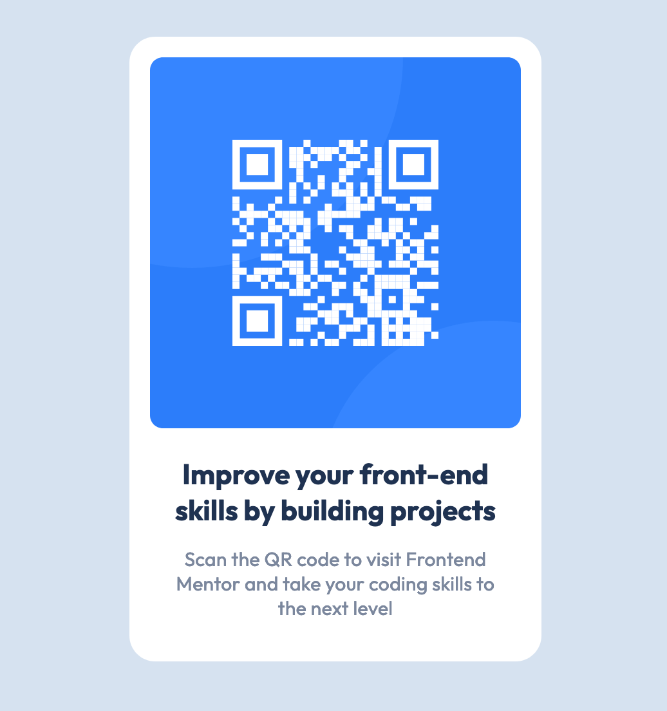

# Frontend Mentor - QR code component solution 

## overview
Welcome to my Frontend Mentor QR code solution! This challenge allowed me to solidify my HTML, CSS, and Sass skills by creating a responsive QR code to encourage users to visit Frontend Mentor and level up their coding skills.

## Screenshot

## links
[See the page here!!](https://joannabroad.github.io/Qr-code/)

## author
[to see more me](https://github.com/JoannaBroad)